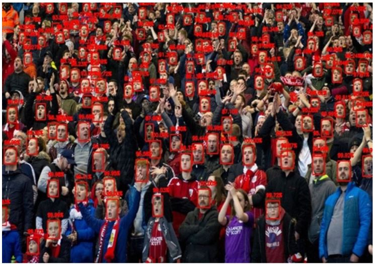

# CNN_Face_Detector
I've worked on the problem of human face detection. This repo amis to develop face detection model based on CNN face detector using opencv and dlib library .

## Requirements
<ul>
<li><b>Python3</b></li>  
<li><b>pre-trained classifiers</b>: model weights file : http://arunponnusamy.com/files/mmod_human_face_detector.dat </li>
<li><b>Opencv</b> [v3]</li>  
  <li><b>dlib library</b></li>
</ul>

## Installation
<ul>
  <b>Note:</b> Dlib has already a pre-trained face detection model. so doesn't need to re-trained it on the human face dataset. just run the script with test images and weight file.
  
  <li>Run the script 
   <code>Python CNN.py --image={Path/to/imgdir} --weights={path/to/weight file}</code>
  
  </li>

  </ul>
  
## Performance of code
<ul>
<h5>Confusion Matrix of Face Detection with Convectional neural network (CNN) with WIDER dataset :</h5>
  <li>ACC: 91.325%</li>
  <li> Hamming Loss: 8.675% </li>
</ul>

## Results

